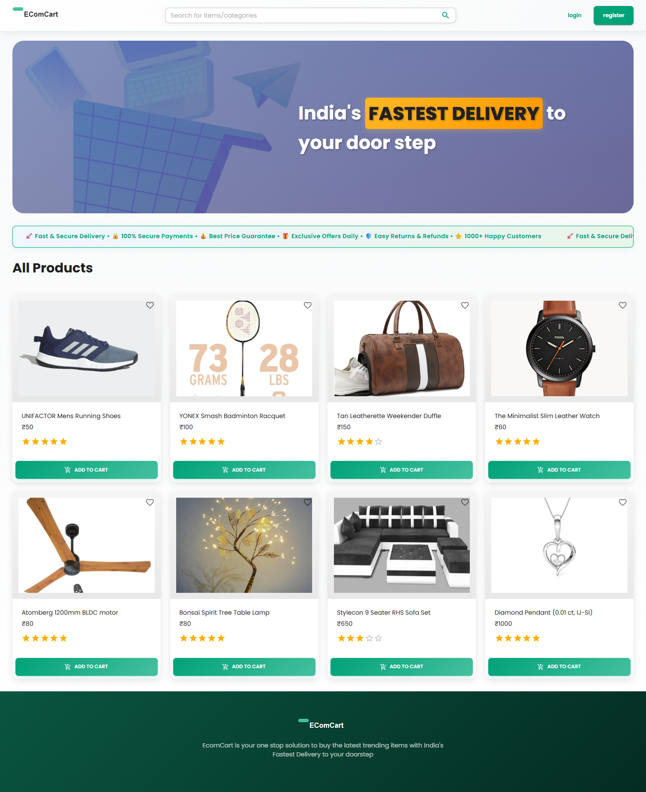
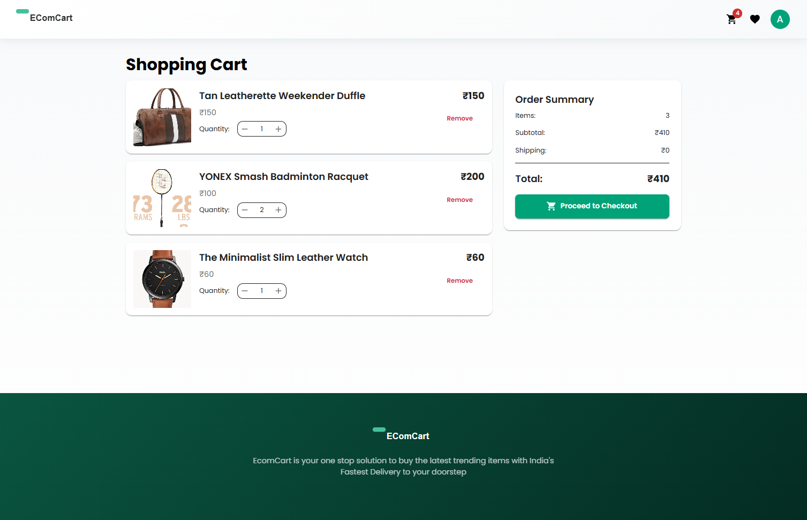
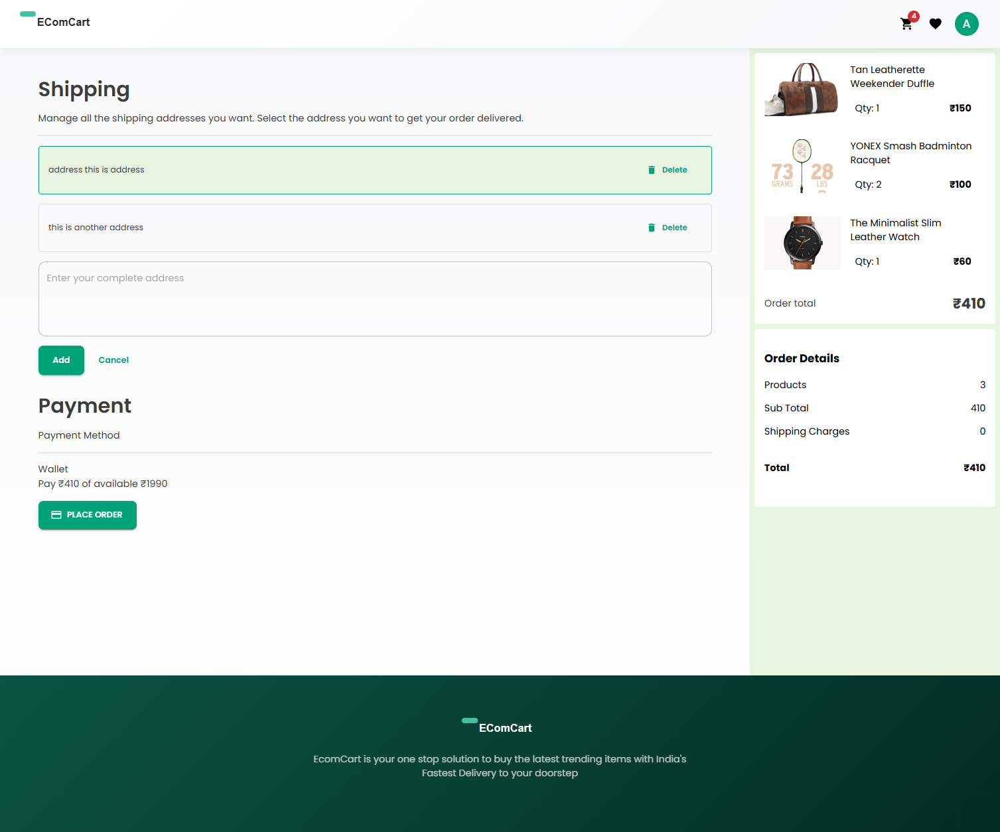
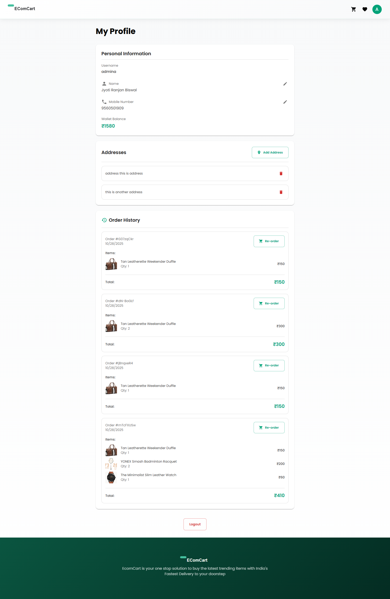
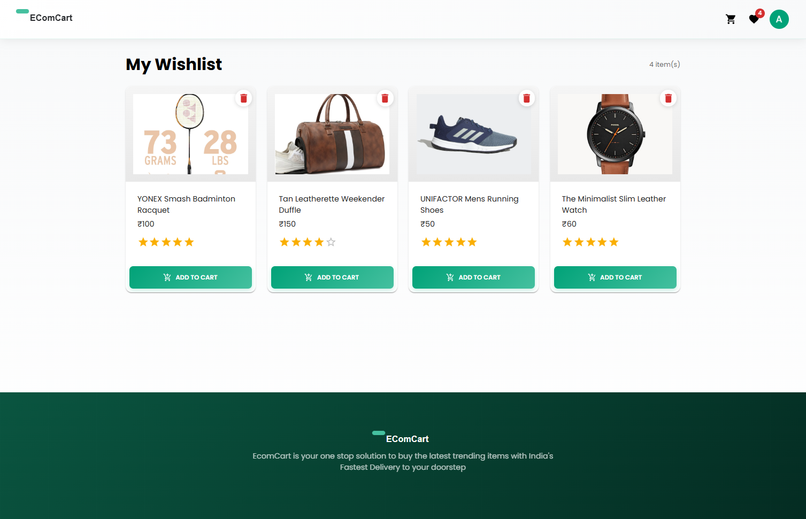
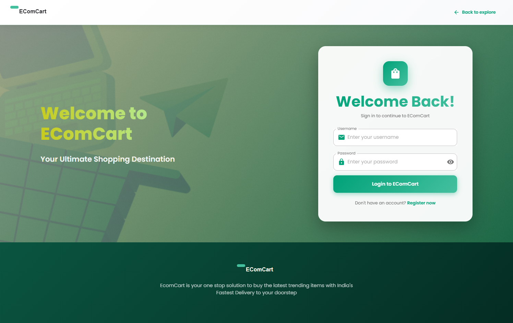
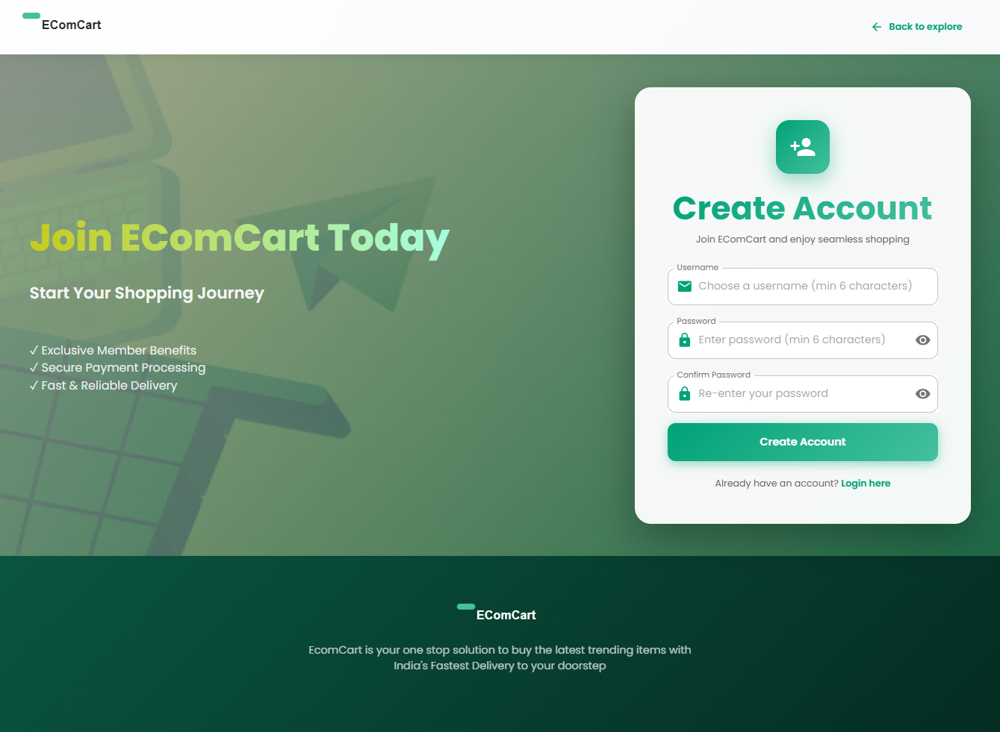

# EComCart Frontend

A modern, responsive e-commerce web application built with Next.js 14, React 18, and Material-UI.

## Live Link
- **Frontend Url**: [https://ecom-cart-fe.onrender.com](https://ecom-cart-fe.onrender.com)


## 🔗 Related Repositories

- **Backend**: [ecom-cart-be (https://github.com/JRanjan-Biswal/ecom-cart-be.git)](https://github.com/JRanjan-Biswal/ecom-cart-be.git) - EComCart backend API


## 📋 Table of Contents

- [Overview](#overview)
- [Features](#features)
- [Tech Stack](#tech-stack)
- [Getting Started](#getting-started)
- [Configuration](#configuration)
- [Project Structure](#project-structure)
- [Key Components](#key-components)
- [State Management](#state-management)
- [Development](#development)

## 🎯 Overview

EComCart is a full-featured e-commerce frontend that provides an intuitive shopping experience with modern UI/UX design. The application features user authentication, product browsing, shopping cart, wishlist functionality, and secure checkout process.

## 📸 Screenshots


*Modern homepage with hero banner, product grid and search functionality*

--


*Shopping cart with item management*

--


*Secure checkout process*

--


*User profile management*

--


*User Wishlists with delte functionality*

--


*User login page with register now button*

--


*Register page with error handling*

## ✨ Features

### Core Functionality
- 🔐 **User Authentication**: Secure login and registration
- 🛍️ **Product Browsing**: Browse products with search functionality
- 🛒 **Shopping Cart**: Add, update, and remove items from cart
- ❤️ **Wishlist**: Save favorite products for later
- 📦 **Checkout**: Secure checkout with address management
- 💰 **Balance System**: Virtual wallet for purchases
- 📊 **Order History**: View past orders
- 👤 **User Profile**: Manage profile and addresses

### UI/UX Features
- 🎨 **Modern Design**: Beautiful gradients and animations
- 📱 **Responsive Layout**: Mobile-first design approach
- 🎭 **Material-UI Components**: Pre-built, accessible components
- 🎯 **Real-time Updates**: Instant cart updates
- 🔔 **Toast Notifications**: User-friendly feedback
- 🎪 **Hero Banner**: Eye-catching promotional section
- 📜 **Animated Marquee**: Scrolling promotional messages

## 🛠️ Tech Stack

- **Framework**: Next.js 14.2.15 (App Router)
- **UI Library**: Material-UI v5.16.9
- **State Management**: Redux Toolkit v2.2.7
- **HTTP Client**: Axios v1.7.7
- **Notifications**: Notistack v3.0.1
- **Styling**: CSS Modules, Emotion
- **Testing**: Jest, React Testing Library

## 🚀 Getting Started

### Prerequisites

- Node.js 18+ installed
- Backend API running (default: http://localhost:8082)

### Installation

1. Clone the repository:
```bash
git clone <repository-url>
cd frontend
```

2. Make sure the backend is set up:
```bash
# Backend repository: https://github.com/JRanjan-Biswal/ecom-cart-be.git
# Navigate to backend and start the server
cd ../backend
npm install
npm start
```

3. Install dependencies:
```bash
npm install
# or
pnpm install
```

3. Configure environment variables (create `.env.local`):
```bash
NEXT_PUBLIC_API_ENDPOINT=http://localhost:8082/api/v1
```

### Running the Application

Start the development server:
```bash
npm run dev
```

Open [http://localhost:8081](http://localhost:8081) in your browser.

### Building for Production

```bash
npm run build
npm start
```

## ⚙️ Configuration

### Environment Variables

| Variable | Description | Required | Default |
|----------|-------------|----------|---------|
| `NEXT_PUBLIC_API_ENDPOINT` | Backend API endpoint URL | Yes | `http://localhost:8082/api/v1` |

### API Configuration

The API endpoint is configured in `src/config.js`:
```javascript
export const config = {
  endpoint: process.env.NEXT_PUBLIC_API_ENDPOINT || "http://localhost:8082/api/v1"
};
```

## 📁 Project Structure

```
frontend/
├── src/
│   ├── app/                    # Next.js app router pages
│   │   ├── page.js            # Home page
│   │   ├── cart/
│   │   ├── checkout/
│   │   ├── login/
│   │   ├── register/
│   │   ├── profile/
│   │   ├── wishlist/
│   │   └── thanks/
│   ├── components/             # React components
│   │   ├── Cart.js
│   │   ├── CartIcon.js
│   │   ├── Header.js
│   │   ├── Footer.js
│   │   ├── Products.js
│   │   ├── ProductCard.js
│   │   ├── Marquee.js
│   │   └── ...
│   ├── store/                  # Redux store
│   │   ├── slices/
│   │   │   ├── authSlice.js
│   │   │   ├── cartSlice.js
│   │   │   └── wishlistSlice.js
│   │   ├── store.js
│   │   └── ReduxProvider.js
│   ├── providers/              # Context providers
│   ├── hooks/                  # Custom React hooks
│   ├── config.js               # Configuration
│   └── theme.js                # Material-UI theme
├── public/                     # Static assets
└── package.json
```

## 🎨 Key Components

### Layout Components
- **Header.js**: Navigation bar with cart icon and user menu
- **Footer.js**: Footer with branding and links
- **Layout.js**: Main layout wrapper

### Feature Components
- **Products.js**: Product listing with search
- **ProductCard.js**: Individual product display
- **Cart.js**: Shopping cart page
- **CartIcon.js**: Cart icon with badge and drawer
- **Checkout.js**: Checkout process
- **Marquee.js**: Animated scrolling messages

### Pages
- **Home**: `/` - Product listing
- **Login**: `/login` - User authentication
- **Register**: `/register` - User registration
- **Cart**: `/cart` - Shopping cart
- **Checkout**: `/checkout` - Order placement
- **Profile**: `/profile` - User profile management
- **Wishlist**: `/wishlist` - Saved products
- **Thanks**: `/thanks` - Order confirmation

## 🔄 State Management

### Redux Store

The application uses Redux Toolkit for state management:

#### Auth Slice
- User authentication state
- Token management
- User balance
- Profile data

#### Cart Slice
- Cart items
- Product catalog
- Total items count
- Total value calculation

#### Wishlist Slice
- Wishlist items
- Add/remove operations

### Usage Example

```javascript
import { useSelector, useDispatch } from 'react-redux';

const MyComponent = () => {
  const { isAuthenticated } = useSelector(state => state.auth);
  const cartItems = useSelector(state => state.cart.items);
  const dispatch = useDispatch();
  
  // Use state and dispatch actions
};
```

## 🎨 Styling

### CSS Modules
- Component-specific styles
- Scoped CSS classes
- Global styles in `index.css`

### Material-UI Theme
- Custom theme configuration in `theme.js`
- Primary color: #00a278 (Green)
- Typography: Poppins font family
- Consistent spacing and colors

### Responsive Design
- Mobile-first approach
- Breakpoints: 768px, 1024px
- Flexible grid layouts

## 🧪 Testing

Run tests with:
```bash
npm test
```

Test files are located in `src/__tests__/`:
- Cart.test.js
- Checkout.test.js
- Login.test.js
- Products.test.js
- Register.test.js
- Thanks.test.js

## 📱 Responsive Design

The application is fully responsive with optimized layouts for:
- 📱 Mobile devices (< 768px)
- 📱 Tablets (768px - 1024px)
- 💻 Desktop (> 1024px)

## 🎨 UI Features

### Design Elements
- Modern gradient backgrounds
- Smooth animations and transitions
- Hover effects on interactive elements
- Custom scrollbar styling
- Toast notifications for user feedback
- Rounded corners and shadows

### Color Scheme
- **Primary**: #00a278 (Green)
- **Secondary**: #ffb825 (Orange)
- **Background**: Gradient from #f8f9fa to #ffffff
- **Text**: #212121 (Dark)

## 🔧 Development

### Adding New Components

1. Create component in `src/components/`
2. Create CSS file if needed
3. Export from component
4. Import and use in pages

### Adding New Pages

1. Create page in `src/app/` directory
2. Add route configuration if needed
3. Update navigation in Header.js

### State Management

1. Add new slice in `src/store/slices/`
2. Export actions and selectors
3. Update store configuration
4. Use in components with hooks

## 🐛 Troubleshooting

### Common Issues

**Port already in use:**
```bash
# Kill process on port 8081
npx kill-port 8081
```

**Module not found:**
```bash
# Clear cache and reinstall
rm -rf node_modules .next
npm install
```

**Backend connection issues:**
- Verify backend is running on port 8082
- Check API endpoint in config.js
- Verify CORS settings in backend

## 📝 License

This project is for educational/evaluation purposes.

## 👨‍💻 Developer

**Jyoti Ranjan**

Created as part of the EComCart e-commerce platform.

**GitHub**: [@JRanjan-Biswal](https://github.com/JRanjan-Biswal)
